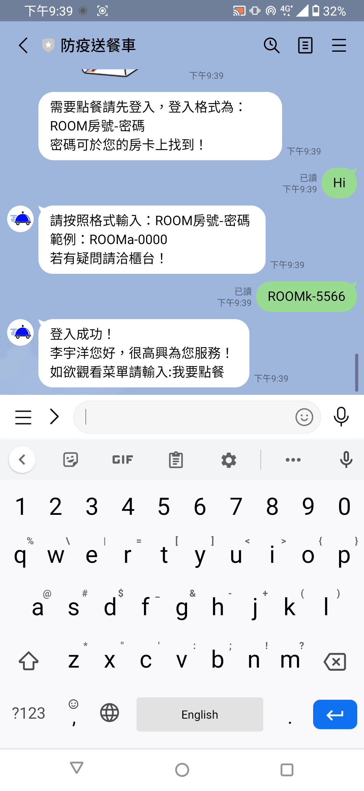

# 防疫送餐車
##### Final Project of Single Chip System
Time : 2021 fall (first half semester of junior)

## Youtube demo 影片
[](https://youtu.be/XrFcHdg5gzE)


## 課程

|科目|教授|
|:-:|:-:|
|[單晶片系統](http://class-qry.acad.ncku.edu.tw/syllabus/online_display.php?syear=0110&sem=1&co_no=E230900&class_code=)|[戴政祺](https://www.ee.ncku.edu.tw/teacher/index2.php?teacher_id=125)|

## 環境說明

|資料夾|說明|
|:--|---|
|`auto_car`|燒錄於Arduino mega 2560開發板的程式，用途為驅動車體移動、自動掀蓋機。|
|`backend`|使用node.js框架，架在Heroku的server，包含點餐前端介面`Order-System`與line bot,、ESP32、資料庫溝通的程序`Server`。|
|`esp32_mod`|燒錄於使用Arduino框架的NodeMCU-32s開發板(晶片 : ESP32)的程式，用途為驅動車上的模組，包括OLED面板顯示、秤重模組、RFID房卡辨識、DFplayer語音撥放等功能。|
|`resource`|`microSD`為存放在microSD卡的`mp3`, `wav`音檔，供模組DFplayer使用。|

## 研究動機
新冠疫情肆虐全球，大減餐廳的內用生意，而外送訂餐儼然已成為生活常態，而各外送平台為了避免外送時造成的接觸感染，提出了無接觸外送 - Foodpanda在領取商品時，外送員與消費者保持1公尺以上的距離。而Uber eat採用線上支付或是放在門口。

但同時無接觸外送也引發了某些問題 - 放在門把上、放在地上、被偷走、使用非實體支付遭重複扣款，因此以此問題為出發點，我們想實現**全自動的防疫送餐車**，讓消費者不需要直接與外送員面對面取餐，減少染疫風險。

## 使用材料
### 開發版
#### (一)車體開發板 Arduino Mega 2560
Arduino Mega 2560開發板比起Arduino Uno開發板擁有更多的GPIO，包括15個PWM、54個Digital I/O，符合我們車體需要3個控制馬達`L298N`的要求。

#### (二)車上模組開發板 NodeMCU-32s
NodeMCU-32s開發版使用ESP32晶片，有以下功能符合我們的需求
- 內建Wi-Fi，可與架在Heroku的server連線。
- 內建藍芽，可與Arduino Mega 2560板連線。
- 擁有更大的記憶體(Flash 4-32 MB)，可以跑更大的程式。
- 留給使用者彈性大，可根據需求修改分區表。
- 支援動態配置，可以直接操作記憶體的heap區。
- 價格便宜、性價比高，NodeMCU-32s開發板網路價為台幣190元。

### 模組
#### (一)車體開發板 Arduino Mega 2560
|功能|模組|通訊|
|:-:|:-:|:-:|
|驅動馬達轉動車輪|控制馬達`L298N`|3條(1條PWM)2組|
|與NodeMCU-32s開發版連線|藍芽模組`HC-05`|UART 2條|
|自動掀蓋機(optional)|控制馬達`L298N`|3條(1條PWM)|
|5路循跡感測器(optional)|紅外線感測器`TCRT5000`|OUT1~5|
> 考量到實際場地的不平，需要反覆調參數測試，因此在最終版的demo中，並未實裝5路循跡感測器的功能。

> 自動掀蓋機因為板子無法燒錄的硬體問題，因此在最終版的demo中，改為使用者手動開啟。

#### (二)車上模組開發板 NodeMCU-32s
|功能|模組|通訊|
|:-:|:-:|:-:|
|在車上顯示即時資訊|黃藍雙色 `SSD1306 0.96吋 OLED`|I^2^C 共用|
|操作OLED面板|遊戲搖杆、按鈕|OUT1,2、訊號線1條|
|在車上秤重，防止運送時的突發狀況(實際demo用手機當作食物去測重)|秤重模組`HX711`|I^2^C 共用|
|個別房卡辨識|RFID模組`MFRC-522`、房卡(RFID)|I^2^C 共用(UART、I^2^C、SPI皆可)|
|播放相應提示聲音|wav,mp3解碼器`DFPlayer`、MicroSD卡、喇叭|UART 2條|
|播放相應提示聲音2|無源蜂鳴器|訊號線1條|
|與Arduino Mega 2560開發版連線|藍芽模組`HC-05`|UART 2條|
> NodeMCU-32s有內建藍芽功能，但由於ESP32的http client與藍芽功能共用同一條天線，所以http client與藍芽不能同時開啟，因此我們使用額外的藍芽模組`HC-05`來解決這個問題。

- 房卡(RFID)，上面標示文字即為房號與登入系統的密碼

- 車上模組


### 車體
使用汶諺學長以前專題的車體。
<br>
輪子是使用**麥克納姆輪，實現全向移動**，適用於轉動空間較小的地點。


### 後端架構
#### (一)Heroku
<br>
**雲端運算平台**，支援多程式語言功能，提供使用者雲端解決方案服務。可以想像為使用者放置在網路上的一台電腦中的compiler，替使用者進行上傳code的執行，並且不同於使用者在自己電腦執行(本地端)，而是可以透過Https協定進行網路連線與傳輸。

Heroku在使用上會與Git搭配，每次進行版本更新都需要利用Git Push來Deploy最新的版本，好處是在進行版本控制非常方便，當需要回溯程式碼時直接使用Heroku的Rollback功能即可實現。

在此次專題為我們提供後端程式(Node.js)在其伺服器上運行的功能，除此之外也透過其與Line Messaging API的Webhook功能讓我們能方便使用創建好的Line bot。

#### (二)MongoDB / MongoDB Atlas
<br>
**資料庫管理系統**，提供使用者雲端儲存資料的服務，可以透過與指定資料庫進行連線，並對資料進行Find、Update、Delete、Create等動作以及衍伸的多種功能。

此外也有提供MongoDB Compass這款應用程式，與原本的MongoDB Shell相同的點是一樣可以對資料庫直接進行操作，不同的點是MongoDB Compass提供了人性化的使用者UI介面，在對資料操作方面更為方便。

在此次專題為我們提供使用者資料、歷史訂單資料、房間資訊的儲存，以及查找比對資料和更新資料等功能。

#### (三)Line Messaging API
<br>
**聊天機器人**，Line公司提供創作者建立聊天機器人頻道的服務，可以透過在後端撰寫的程式碼以及在Line創作頁面的設定來與使用者進行互動。

透過提供頻道的`CHANNEL_SECRET`、`CHANNEL_SECRET`、`CHANNEL_ACCESS_TOKEN`便可以簡單地與Heroku進行連接，進而使用其Webhook功能，以達到與使用者傳輸訊息的功能。

在此次專題為我們提供與使用者進行交換訊息的前端功能。

#### (四)React
<br>
**前端開發框架**，協助開發者對前端進行高效率、高性能的開發，可以透過其較輕易地組建複雜且龐大的前端應用程式，且其組件化開發模式可以透過類似於物件的方式重複使用組件讓開發效率提升、開發難度降低。

在此次專題為我們前端點餐網頁撰寫所使用的工具。

#### (五)Node.js
<br>
**JavaScript引擎**，用來直接編譯撰寫的javascript檔案，並且可以透過Node.js引入很多易於使用與開發的模組及套件。

在此次專題為我們後端執行、編譯程式碼以及透過其引入多個開發套件，例如：`Express.js`、`LineBot`等。

## 產品設計
|概念圖|Line的圖文選單|點餐網址介面|
|:-:|:-:|:-:|
||||

## 功能描述
### 簡述
完成送餐流程如下，依序為
1. Line上點餐
2. 後場確認餐點後送出
3. (車輛前往指定房號...)
4. 送達指定房號並由消費者完成取餐手續
5. (車輛返回起始點...)
6. 重複步驟1，繼續下一筆訂單

另外還有以下5個異常處理的狀況。
1. 運送途中食物重量異常減少
2. 消費者未遵照正常手續直接取餐
3. 消費者使用房卡(RFID)感應錯誤超過3次
4. 後場人員在一開始即取消訂單
5. 消費者逾時未取餐

### 正常流程
1. **消費者使用Line介面並導向指定網頁點餐**

|Line介面|內容描述|Line介面|內容描述|
|:-:|:-:|:-:|:-:|
||1. 加入"防疫送餐車"Line好友||2. 選擇"我要點餐"的圖文選單|
||3. 登入系統(輸入房號與密碼)||4. 導入指定網址點餐|
||5. 計算消費金額並送出||6. 餐點發送後會實時通知目前的物流狀況、按"歷史定單"的圖文選單可以查詢所有訂單(包括目前這筆)的狀態|

|車體介面|內容描述|
|:-:|:-:|
||未收到訂單|

2. **後場人員確認餐點後送出**

|車體介面|內容描述|
|:-:|:-:|
||1. 收到新訂單的通知(蜂鳴器+語音提示)|
||2. (當後場備妥餐點後...)|
||3. 使用遊戲搖桿選擇"delivery"選單|
||4. 放餐點夾在防疫蓋與秤重模組之間|
||5. 按下按鈕(enter鍵)|
||6. 五秒發車並計算食物重量|

|Line介面|內容描述|
|:-:|:-:|
||發車後消費者通知|

3. **(車輛前往指定房號...)**

|車體介面|內容描述|
|:-:|:-:|
||OLED顯示餐點公克數|

4. **送達指定房號並由消費者完成取餐手續**

|車體介面|內容描述|
|:-:|:-:|
||1. 送達目的地並宣讀購買項目與數量|
||2. 房卡感應|
||3. 拿取餐點並完成交易|

|Line介面|內容描述|Line介面|內容描述|
|:-:|:-:|:-:|:-:|
||餐點抵達目的地消費者通知||完成訂單消費者通知|

5. **(車輛返回起始點...)**
6. **重複步驟1，繼續下一筆訂單**

### 異常處理
|Line/車體介面|狀況|異常處理|
|:-:|:-|:-:|
||運送途中食物重量異常減少|停車，提示語音並於4秒撥放警報聲|
||消費者未遵照正常手續直接取餐|提示語音並於5秒撥放警報聲|
||消費者使用房卡(RFID)感應錯誤超過3次|此筆訂單取消|
||後場人員在一開始即取消訂單|取消該筆訂單|
||消費者逾時未取餐|取消該筆訂單|

## 原理說明
### 系統架構與使用者的交互體驗


### 循跡與房號編碼
#### (一)循跡
紅外線感測器`TCRT5000`由5對紅外光二極體和高靈敏光電晶體組成。紅外光照射在黑色物體上時，光線被吸收，則該燈號輸出logic low。照射在其他顏色之物體，紅外光皆會反射，則該燈號輸出logic high。<br>
<br>
實作中使用中間三個紅外線(OUT2、OUT3、OUT4)作為循跡判斷。下方表格為對應燈號之車體修正結果。

|OUT2|OUT3|OUT4|判斷結果|
|:-:|:-:|:-:|:-:|
|1|0|1|車體前進|
|1|0|0|車體向右修正|
|0|0|1|車體向左修正|

#### (二)房號編碼
紅外線感測器`TCRT5000`由5個邏輯燈號組成，其輸出結果最多為$2^5=32$種可能。扣除直線之輸出為11011不能作為房號，剩餘31種組合皆可做為房號編碼使用。本次實作選用三個編碼做為房號，分別為11000、10001、00011，下表為房號所對應之編碼圖示。
|房號|編碼|循跡圖示|
|:-:|:-:|:-:|
|`h`|11000||
|`j`|10001||
|`k`|00011||
> 考量到實際場地的不平，需要反覆調參數測試，因此在最終版的demo中，並未實裝循跡與房號編碼的功能。

### ESP32與各個模組之間的通訊

ESP32(NodeMCU-32s)每隔3秒會訪問路徑`/Update`的，在未收到訂單時，會回傳`0`，而當使用者在網頁中送出訂單後，server會將`/Update`的數字改為`1`，而當ESP32再次訪問時，`/Update`的數字就會變為`0`，因此ESP32可以知道目前收到一筆訂單，並訪問server的路徑`/Order`，獲得以下`json`數據。

```json
{
    "menu": [1, 2, 0, 0, 0, 3, 1, 8, 33, 0],
    "room": "h",
    "rfid": [0, 9, 10, 5],
}
```
ESP32使用`ArduinoJson.h`函式庫進行`json`解析，獲得10項商品的數量、房號位置、對應RFID的UID。
```cpp
template <typename T>
class Queue {
    struct Node {
        T room_number;
        int menu[10];
        int UID[4];
        Node *next;
        long waiting_time;
    };
    Node *head;
    Node *tail;
    int qsize;
    long start_time;
    public:
    Queue() {
        head = NULL;
        tail = NULL;
        qsize = 0;
    }
    ...
    void put(int (&menu)[10], const T &room_number, int (&UID)[4]) {
        Node *newNode = new Node;
        if (qsize) {
            tail->next = newNode;
            newNode->room_number = room_number;
            for (int i = 0; i < 10; i++)
                newNode->menu[i] = menu[i];
            for (int i = 0; i < 4; i++)
                newNode->UID[i] = UID[i];
            newNode->waiting_time = millis();
            newNode->next = NULL;
            tail = newNode;
        } else {
            head = tail = newNode;
            newNode->room_number = room_number;
            for (int i = 0; i < 10; i++)
                newNode->menu[i] = menu[i];
            for (int i = 0; i < 4; i++)
                newNode->UID[i] = UID[i];
            newNode->waiting_time = millis();
            newNode->next = NULL;
        }
        qsize++;
    }
}
```
將解析得到的資訊調用自定義`queue`的成員函數`put`，加進隊列(enqueue)。
```cpp
// 宣告UART接口1
HardwareSerial SerialBT(1);
// HC-05
SerialBT.begin(38400, SERIAL_8N1, 27, 13);  // Serial的TX,RX
//車輛移動到h, j, k的位置
SerialBT.write(queue.room_number());
```
當後場人員送完餐點後，從`queue`中讀取房號，並寫入ESP32的藍芽模組，假設`queue.room_number()`的返回值是`h`，會傳給Arduino mega 2560板子`h`，使其移動到`h`的位置。
```cpp
if (SerialBT.available()) {
    char completed = SerialBT.read();
    if (completed == '1') {
        notice_status("/Arrived"); // notice line
        state = 2;
        return;
    }
}
```
當ESP32收到Arduino mega 2560板子回傳的藍芽資訊`1`時，代表指派給車體移動的任務完成，接下來ESP32會進入下一個`state`，處理消費者付款的手續。其中也會訪問一次server的路徑`/Arrived`，讓server能告知使用者物流的狀態。

### 後端技術


#### (一)與Line bot間的通訊
```javascript
const linebot = require('linebot');
const bot = linebot({
    channelId : process.env.CHANNEL_ID,
    channelSecret : process.env.CHANNEL_SECRET,
    channelAccessToken : process.env.CHANNEL_ACCESS_TOKEN
});
const linebotParser = bot.parser();
app.post('/linewebhook', linebotParser);
```
透過引入`linebot`套件來使用其API，並且因為已經在Heroku的設定上與要使用的Line bot頻道進行掛勾，因此在使用上非常方便，只需使用環境變數在雲端執行時便會自己抓取設定好的頻道資訊。

在最後兩行引入`body-parser`套件來協助解析Line bot傳輸的body，由於我們在傳輸時是使用URL上的`Route`，因此需要在Line開發頁面上設定好URL網址作為事先約定好的傳輸通道，以我們的為例是`https://indoor-foodie.herokuapp.com/linewebhook`，其中`indoor-foodie.herokuapp.com`是由Heroku提供，而`/linewebhook`則是上面我們自行設定的傳輸通道。
```javascript
bot.on('follow',function (event) {
	client.getProfile(event.source.userId)
  	.then((profile) => {
		UserID=event.source.userId;
		UserName=profile.displayName;
  	});
bot.on('message',async function (event) {
	client.getProfile(event.source.userId)
	.then((profile) => {
		UserID=event.source.userId;
		UserName=profile.displayName;
	});
    
app.listen(process.env.PORT || 80, function(){
	console.log('Linebot Running');
});
```
上面為實際使用其API的情況，此次專題只有使用Follow(加入好友)與Message(發送訊息)兩種情況。下面則為Line bot指定的聆聽通道(port)為80。

#### (二)與資料庫間的通訊
```javascript
const mongoose = require('mongoose');
//使用者Schema => 以使用者ID做判定
const UserSchema = new mongoose.Schema({
    UserID: String, 	//用作查找使用者的依據 => 利用UserID(目前發言者)查找
    UserName: String,	//使用者名稱
    totalmoney: Number,	//此使用者所有訂單消費
    room: String,		//此使用者居住房號 => 若登出要消除
    Isorder: Boolean,	//確認使用者是否有送出訂單
    orderNUM: Number,	//記錄此使用者擁有的訂單數
})
//歷史訂單Schema => 以使用者的ID做判定
const HistorySchema = new mongoose.Schema({
    UserID: String,	//用作查找訂單的依據=>利用OrderUserID(目前發出訂單者)查找
    orderNUM: Number,	//記錄此筆訂單是此使用者第幾筆
    order: [Number],	//訂單內容
    money: Number,		//單筆訂單之價格
    orderstatus: String,	// finished / working / canceled
    RFIDWrong: Number,	//此筆訂單RFID錯誤次數
})
//房間資訊Schema => 以房號做判定
const RooomSchema = new mongoose.Schema({
    Islogin: Boolean,	//記錄此房號是否有登入 => 若登出要消除
    CurrentUserID: String,	//紀錄目前此房號的房客 => 若登出要消除
    CurrentUserName: String,//紀錄目前此房號的房客 => 若登出要消除
    room: String,		//房號
    pass: String,	        //密碼
    RFID: [Number],	//UID
})

const User = mongoose.model("User", UserSchema);
const historyOrder = mongoose.model("Historyorder", HistorySchema);
const Room = mongoose.model("Room", RooomSchema);
```
透過引入`mongoose`套件以方便我們在Node.js上直接對資料庫進行操作而非還需要透過MongoDB Shell建立資料庫，其API使用方式與原本MongoDB語法類似，需要先建立一個Schema(類似class)並在裡面定義各項Property(利用`json`格式進行儲存)，之後再進行物件實體化為一個Model(類似object)。
```javascript
let userdata =
    await User.findOne({ UserID: OrderUserID, UserName: OrderUserName })
```
每個Model底下都有可以用來查找、更新、刪除與創建資料的member function，使用方式可以參照[Mongoose官方文件](https://mongoosejs.com/docs/api/model.html)。

#### (三)與ESP32間的通訊
```javascript
const express = require('express')
app.use(bodyParser.urlencoded({ extended: true }));

app.get('/Canceled', async function (req, res) {
    bot.push(OrderUserID, OrderUserName +
        '您好，因為您的訂單出現錯誤\n所以我們已經取消此筆訂單\n造成您的困擾非常抱歉！');
    GetCanceled();
    res.send();
})

app.post('/Menu', jsonParser, async function (req, res) {...})
```
透過引入`express`框架讓我們可以更簡單的架設伺服器，如上也同樣需要使用`body-parser`來進行訊息解析。在一般伺服器的架構中通常只會遇到兩種請求方式：`get`與`post`的形式，而`get`又更為常用，因此此次專題使用到的是`get`。其會搭配有一個我們自訂義的`route`，主要是與ESP32溝通好後互相設定一樣的`route`，當有任何事件觸發時即訪問特定的URL，並且伺服器端接受到`req`(請求)後會根據情況返回對應的`res`(回應)，藉此就可以達到伺服器端與ESP32的通訊。

#### (四)前端點餐網頁架設
```javascript
import React, { useState } from "react";
const addHandler = (index, amount) => {
    setProduct((prev) => {
        let newProduct = [...prev];
        newProduct[index] += amount;
        return newProduct;
    });
};
const totalPriceHandler = (price) => {
    setTotal((previousTotal) => previousTotal + price);
};

const resetHandler = () => {
    setTotal(0);
    setProduct([0, 0, 0, 0, 0, 0, 0, 0, 0, 0]);
    setShow(false);
};

const confirmHandler = () => {
    setShow(false);
};
const submitHandler = () => {
    console.log(Product);
    setShow(true);
};
const closeHandler = () => {
    setShow(false);
};

const sendHandler = () => {
    setShow(false);
    axios.post("https://indoor-foodie.herokuapp.com/Menu", {
        product: Product,
        total: total,
    });
};
```
透過引入`React`框架方便我們進行前端菜單網頁開發，可以看到上面有好幾個Handler組成的組件，在對應不同情況觸發不同的功能(e.g.:點選按鈕後新增餐點；點選按鈕後跑出下拉數目條；點選按鈕後提交餐點)，並且可以看到最後面透過`axios`套件與原本後端伺服器上的一個route連接，再透過`post`傳遞餐點資料，完成了方便使用者點餐的菜單。

## 心得
### 劉永勝
這次的專題我們的主題雖然是防疫送餐車，但實際上我們從點餐、出餐、送餐、取餐、結帳，整個流程都進行了整合。點餐部分為了使消費者能接收即時資訊，使用了Line作為餐點物流通知，也使用圖像介面之網頁選單，讓顧客能簡易的進行餐點的數量選擇。送餐過程中，重量感測模組會時刻紀錄餐點重量，以確保餐點在運送過程之狀況，並用Line與消費者通知餐點之即時訊息。藉由循跡模組抵達指定房號後，顧客藉由房卡感應，確認餐點送達，並提取餐點。

### 李宇洋
此次專題實作是一個很新的體驗，實際動手去把之前學過的模組應用出來，又要透過專題的不同需求自己去學習如何使用另外的一些模組、後端技術等等，那也因為這樣我們確實做出了一個算是非常完善的系統，從點餐的使用者介面，到送餐的使用者操作流程、整個送餐車系統的優化，以及最後送餐完畢自走車自行返回的功能等，可以說算是一個滿意的專題作品。

### 陳旭祺
這次我們專題內容或許不是什麼新奇的創意，但我重點擺在學會使用別人寫好的工具去實現自己想完成的系統，從學期初，不會用MCU去控制LED亮暗，到期末做出一個完整、像樣的系統，雖然很花時間，但同時我也學到了很多知識。
- **組員的內容分配**<br>
這應該是每次分組合作最頭痛的問題，常常因為各個功能之間的相關性，造成甲方要完成任務之前要乙方先完成，而乙方要完成任務之前又需要甲方完成，而產生deadlock。因此在一開始我們就分配好我負責車上模組、劉永勝負責和車體移動相關的任務(循跡、房號編碼)、李宇洋負責後端處理(Line bot, HTTP server)，**降低我們程式之間的耦合性，並先討論好彼此通訊的規則**，包括跟後端對接的`json`格式與跟mega 2560的藍芽傳輸字串格式，**因此我們彼此之間不需要知道對方具體的實踐內容，只需要知道傳輸接口的規則**，如此才能增加我們的工作效率，就再需要反覆無意義的討論了。
- **網際網路的基礎知識**<br>
由於一開始ESP32未與架在Heroku的server連線，因此我是把ESP32當作**local server接受HTTP請求**，其中需要具備WIFI的AP(WIFI熱點)與STA(WFI終端)模式、公網IP與私網IP等網路連線的基本知識。等到後期與架在Heroku的server連線時需要了解HTTP的請求與解析server回應本體的`json`格式文檔。
- **熟悉ESP32晶片的開發板**<br>
	上課時是選用Arduino Uno板子，由於這次專題需要WIFI連線的功能，因此改用效能更為強大的ESP32晶片，雖然一樣是使用Arduino的程式框架，但在**部分函式呼叫上與原生Arduino不相容**。以無源蜂鳴器為例，在原生Arduino只需要`analogWrite()`，但在使用Arduino框架的ESP32上需要完成以下3個步驟: 
	1. 設定頻道LEDchannel屬性 `ledcSetup(LEDChannel, freq, resolution)`
	2. 附加到PIN腳 `ledcAttachPin(ledPin, LEDChannel)`
	3. 決定輸出大小 `ledcWrite(LEDChannel, dutyCycle)`
- **熟悉常見模組使用**<br>
如[模組](#模組)列表，我也額外測試GPS定位模組`GY-NEO6MV2`，**幾乎是大部分Arduino能玩的模組都學會如何使用**。以DFPlayer為例，它是一個wav,mp3解碼器，需要將要撥放的歌曲按照指定格式存進容量32GB以下的microSD卡，並且外接功率3W以下的外放喇叭才能撥放聲音，它的通訊是使用UART協定，由MCU透過寫入要撥放哪一首歌曲、要暫停撥放的指令；而MCU透過DFPlayer的TX接口接受目前DFPlayer模組的狀態，包括現在是否有歌曲這在撥放、音量多少、microSD是否有正確讀取等狀態。
- **如何清楚並簡潔地介紹我們的產品**<br>
	在第二次報告時，教授的回饋是不清楚我們的產品內容，因此在最後一次報告時，我梳理了一下如何清楚並在短時間內介紹我們的商品，分為以下3點 : 
	1. 選用影片呈現，可以透過剪輯的手法，將我們要呈現的內容**壓在一定時間內表達**。
	2. 不要一股腦兒所有東西都呈現給別人看，因此在影片demo時分為正常流程與異常處理，一開始正常流程先跑完一遍所有的送餐程序，**讓別人熟悉我們的送餐流程後，之後才做異常處理的分支**，介紹我們系統是如何反應各個突發狀況。
	3. 不要加入無意義的影片CG特效，而是**專注於實際的內容**，在影片方面我的大方向就是條列是介紹我們的流程，現在影片播到哪裡，就列出當下是哪一個送餐步驟。